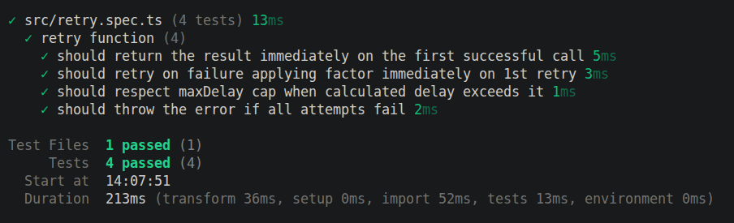

# node-async-retry

TypeScript utility to retry an async operation with configurable attempts and backoff.

## Task Details

This project implements a generic `retry` helper that:

- Accepts an async function `fn`.
- Retries up to `maxAttempts` times.
- Uses delay progression based on `initialDelay * factor^attempt`.
- Supports optional `maxDelay` to cap computed delays.
- Throws the final error when attempts are exhausted.

### Function Signature

```ts
retry<T>(
	fn: () => Promise<T>,
	options: {
		maxAttempts: number;
		initialDelay: number;
		factor?: number;
		maxDelay?: number;
	},
): Promise<T>
```

## Project Scripts

```bash
pnpm dev
pnpm build
pnpm test
pnpm test:watch
```

## Test Coverage

Current tests verify:

- Immediate success on first attempt.
- Retry behavior with factor applied from first retry.
- Respecting `maxDelay` cap when computed delay is larger.
- Throwing error when all attempts fail.

## Test Result Screenshot


